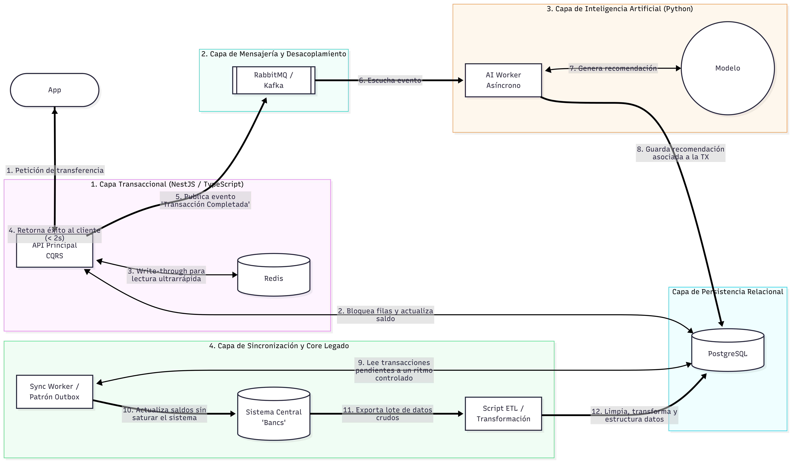
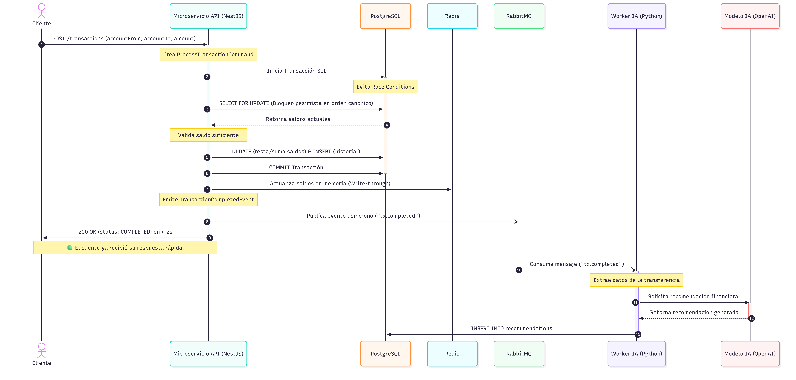
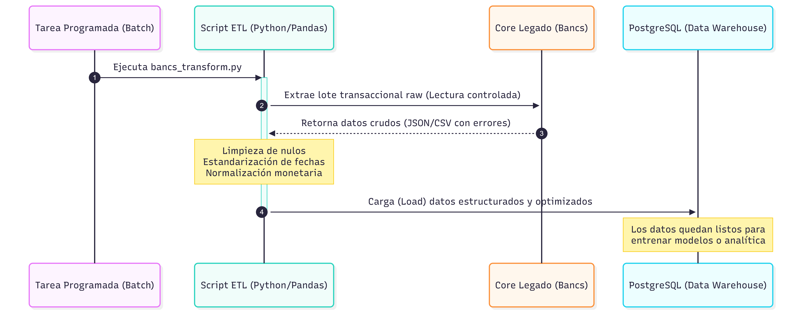

# Arquitectura del Sistema: SmartBancs App

## 1. Contexto y Objetivos del Negocio
Una institución financiera requiere construir **"SmartBancs App"**, una plataforma orientada a procesar transacciones en tiempo real y ofrecer recomendaciones financieras personalizadas impulsadas por inteligencia artificial.

### Desafíos y Restricciones
- **Alta concurrencia:** El sistema debe soportar picos transaccionales elevados (hasta 10,000 transacciones por segundo).
- **Integración con Core Legado (Bancs):** El sistema central del banco ("Bancs") es un sistema transaccional heredado, robusto pero poco flexible. No puede recibir un alto volumen de consultas directas sin que su rendimiento se degrade.
- **Tiempo de respuesta estricto:** Las transferencias deben completarse en menos de 2 segundos. Además, las recomendaciones de IA no deben bloquear ni retrasar el flujo transaccional principal de cara al usuario.

---

## 2. Visión General de la Arquitectura
La arquitectura está diseñada con un enfoque orientado a eventos y segregación de responsabilidades (CQRS), lo que permite desacoplar el procesamiento transaccional ultrarrápido de las tareas asíncronas pesadas (IA) y de la sincronización con el sistema legado.



La solución se divide en cinco capas principales:
1. **Capa Transaccional (NestJS / TypeScript):** API principal que gestiona las peticiones de transferencia, aplicando CQRS y utilizando Redis como caché de lectura ultrarrápida (*write-through*).
2. **Capa de Mensajería y Desacoplamiento (RabbitMQ):** Actúa como bus de eventos para comunicar la capa transaccional con los procesos asíncronos.
3. **Capa de Inteligencia Artificial (Python):** Un *AI Worker* asíncrono que consume eventos para generar recomendaciones mediante un modelo de IA sin bloquear la API principal.
4. **Capa de Persistencia Relacional:** Base de datos principal (PostgreSQL) para el almacenamiento definitivo de transacciones y saldos.
5. **Capa de Sincronización y Core Legado:** Mecanismos de lectura/escritura hacia el sistema "Bancs" mediante patrones *Outbox* y scripts ETL, evitando su saturación.
6. **Capa de Interfaz y Observabilidad:** Frontend en HTML/JS servido por Nginx (Dashboard Web) para ejecutar peticiones y auditar el sistema en conjunto con Grafana.

---

## 3. Flujo Transaccional y de Recomendaciones
Para cumplir con el SLA de < 2 segundos por transferencia, el flujo crítico se ejecuta de manera transaccional y delega el resto de responsabilidades de forma asíncrona.



### Secuencia de Operaciones
1. **Petición del Cliente:** El usuario realiza una transferencia mediante `POST /transactions`.
2. **Control de Concurrencia:** NestJS inicia una transacción SQL hacia PostgreSQL. Para evitar *race conditions* y asegurar la integridad a 10,000 TPS, utiliza un `SELECT FOR UPDATE` (bloqueo pesimista en orden canónico).
3. **Ejecución y Caché:** Tras validar el saldo, se realizan los `UPDATE` e `INSERT` necesarios y se consolida la transacción (`COMMIT`). Inmediatamente, se actualizan los saldos en Redis usando la estrategia *Write-through*.
4. **Respuesta Inmediata:** Se emite un `TransactionCompletedEvent` a RabbitMQ y se retorna un código `200 OK` al cliente de inmediato (cumpliendo la restricción de tiempo).
5. **Recomendación IA (Asíncrona):** El Worker IA en Python consume el evento desde RabbitMQ, extrae los datos, solicita la recomendación al Modelo IA (Gemini), y guarda el resultado en PostgreSQL de manera transparente para el usuario.

---

## 4. Flujo de Sincronización y ETL (Integración con Bancs)
La interacción con el core heredado "Bancs" se realiza en segundo plano, controlando el ritmo para proteger el sistema legado.



### Sincronización Saliente
Se utiliza un **Sync Worker / Patrón Outbox** que lee transacciones pendientes en PostgreSQL a un ritmo controlado y actualiza los saldos en Bancs sin causar sobrecargas.

### Proceso ETL (Extracción y Carga)
1. **Extracción:** Una tarea programada (Batch) ejecuta el script `bancs_transform.py` que solicita a Bancs un lote de datos crudos mediante una lectura controlada.
2. **Transformación:** El script desarrollado en Python/Pandas procesa los datos crudos, realizando limpieza de valores nulos, estandarización de fechas y normalización monetaria.
3. **Carga:** Los datos limpios se insertan estructuradamente en un Data Warehouse (PostgreSQL), dejándolos listos para alimentar los modelos de IA o realizar reportes analíticos.

---

## 5. Stack Tecnológico y Estructura del Proyecto

La selección tecnológica responde a los desafíos de alta concurrencia, procesamiento asíncrono y la necesidad de integración híbrida.

### Stack Principal
- **Backend Core:** NestJS (TypeScript) sobre plataforma Express.
- **Mensajería:** RabbitMQ (para desacoplamiento de tareas asíncronas).
- **Bases de Datos:** PostgreSQL (Relacional principal) y Redis (Caché en memoria).
- **Procesamiento e IA:** Python (para el Worker IA y los scripts ETL con Pandas).
- **Observabilidad:** Prometheus.

### Estructura del Proyecto
El código base sigue una estructura modular para separar claramente las responsabilidades:

```text
smartbancs-nestjs/
├── README.md                      
├── docker-compose.yml             
├── .env.example                   # Añade aquí tus variables GEMINI_API_KEY y DB_URL
├── AI_USAGE.md
├── apps/
│   └── transaction-api/           # Microservicio principal NestJS
│       ├── src/
│       │   ├── transactions/      # Dominio principal (CQRS, Comandos, Eventos, DTOs)
│       │   ├── accounts/          # Dominio de cuentas de usuario
│       │   ├── messaging/         # Publicador de eventos hacia RabbitMQ
│       │   └── observability/     # Configuración de logs y métricas
│       ├── Dockerfile
├── services/
│   └── ai-worker/                 # Worker Python para IA (consume RabbitMQ)
│       ├── worker.py
│       ├── Dockerfile
│       └── ai_client.py
├── etl/
│   ├── bancs_raw_data.json        # Archivo con nulos y errores
│   └── bancs_transform.py         # Script ETL (Python/Pandas) para lectura de Bancs
├── frontend/                      # SPA (Dashboard) para pruebas E2E y Stress Tests
│   ├── index.html                 
│   ├── styles.css
│   └── app.js
├── db/
│   ├── schema.sql                 # Esquema de base de datos
│   └── seed.sql                   # Datos semilla
├── infra/
│   ├── grafana/                   # Configuración de grafana
│   ├── prometheus/                # Configuración de métricas
└── docs/
    ├── arquitectura.md            
    ├── decisiones.md
    └── postmortem.md
```
